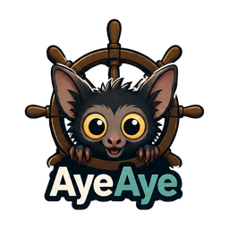
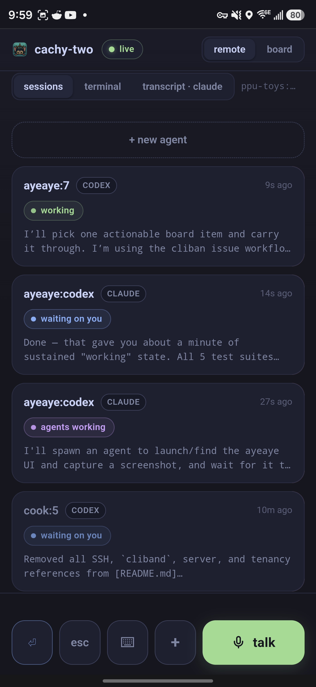
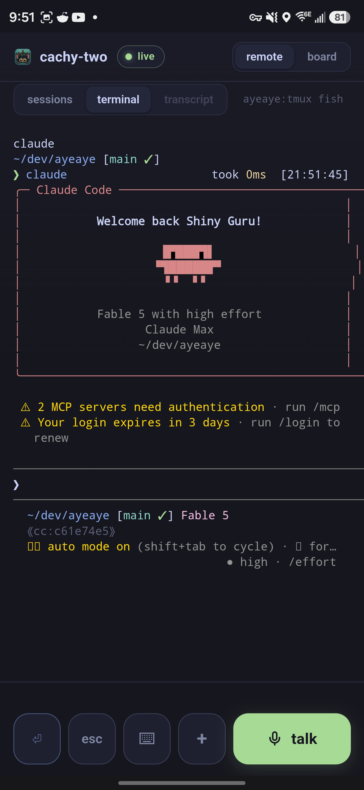
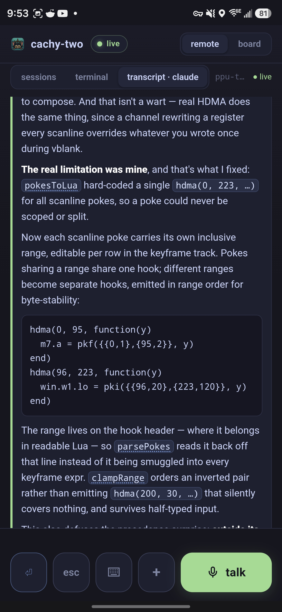

<p align="center"></p>

<h1 align="center">ayeaye</h1>

<p align="center"><b>Your coding agents, in your pocket.</b></p>

ayeaye puts every local Claude Code and Codex session on one phone-sized page.
See who is working, who is waiting, and who delegated. Open a live terminal or
read the clean transcript. Answer prompts, start agents, and dictate replies
without returning to your desk.

<p align="center"></p>
<p align="center"><sub>the whole fleet: working · waiting on you · agents working</sub></p>

It is one self-contained Rust binary: web app, agent discovery, terminal
control, transcript rendering, setup, service management, notifications, and
voice. Speech and cleanup run on your own
[llama-swap](https://github.com/mostlygeek/llama-swap), which ayeaye talks to
over its OpenAI-compatible API. Your sessions and transcripts stay on your
machine.

## Install

Linux and macOS, x86-64 and arm64:

```sh
curl -fsSL https://raw.githubusercontent.com/LioraLabs/ayeaye/main/install.sh | sh
```

The installer verifies the release, installs `ayeaye`, and runs setup. `tmux`
is the only required runtime tool. There is one static binary per platform: no
GPU build, no CUDA runtime, nothing to match against your driver — the models
run in llama-swap, which you build for your own hardware.

```sh
ayeaye setup
ayeaye check
```

Setup normally installs and starts a user service. Open the address it prints,
or run directly with `ayeaye serve`. The default is
`http://127.0.0.1:8911`.

## Run the room from your phone

The sessions view derives live state from the agents and their panes—no agent
plugin or check-in protocol required. Tap any session to move between its real
terminal and a readable, live transcript.

<p align="center"></p>
<p align="center"><sub>the real terminal: inspect it, type into it, answer prompts</sub></p>

<p align="center"></p>
<p align="center"><sub>the same session as a readable conversation</sub></p>

From the same screen you can:

- see Claude Code and Codex sessions across local tmux panes;
- distinguish working, waiting, delegated, idle, and finished agents;
- answer interactive prompts and send terminal keys;
- find a project and launch a new agent there;
- speak a reply and have local models transcribe and clean it up;
- receive a Web Push notification when an agent needs you, then tap straight
  into that session.

## HTTPS for notifications

Install ayeaye to your phone's home screen, serve it over HTTPS, then tap
**enable notifications**. The watcher runs locally and uses Web Push only when
an agent needs attention.

The shortest HTTPS setup is [Tailscale Serve](https://tailscale.com/kb/1242/tailscale-serve):

```sh
tailscale serve --bg http://127.0.0.1:8911
```

For local TLS, [Caddy](https://caddyserver.com/docs/automatic-https#local-https)
works too:

```caddyfile
ayeaye.localhost {
	reverse_proxy 127.0.0.1:8911
}
```

Plain HTTP still runs the app; browsers simply refuse notifications there.

## Voice

Voice needs `ffmpeg` and a running [llama-swap](https://github.com/mostlygeek/llama-swap)
serving two models: a speech model (whisper.cpp's `whisper-server`, which
llama-swap proxies at `/v1/audio/transcriptions`) and a language model for
cleaning transcripts up. ayeaye downloads nothing and loads nothing — llama-swap
owns the weights, the acceleration, and the swapping in and out.

Point ayeaye at it, then pick which of its models plays which part:

```sh
ayeaye model ls                       # what the backend is serving
ayeaye model choose                   # pick both, smoke-testing each
ayeaye model use speech whisper       # or one at a time, by name
ayeaye model use cleanup qwen3-coder
```

The names are whatever keys you gave those models in llama-swap's `config.yaml`.
`choose` and `use` check the name against what the backend is actually serving,
and `choose` proves each model answers before writing the choice down.

A minimal `config.yaml` on the other side:

```yaml
models:
  "whisper":
    checkEndpoint: /v1/audio/transcriptions/
    cmd: |
      whisper-server --host 127.0.0.1 --port ${PORT}
        -m ggml-large-v3-turbo-q8_0.bin
        --request-path /v1/audio/transcriptions --inference-path ""
  "qwen3-coder":
    cmd: llama-server --port ${PORT} -m Qwen3-Coder-30B-Q5_K_XL.gguf
```

Set `AYEAYE_LLAMA_SWAP` if it is not on `http://127.0.0.1:8080` — `https://` and
a path prefix both work, and a backend on another machine is an ordinary setup:

```sh
AYEAYE_LLAMA_SWAP=https://llama.example.test
```

Cleanup is optional. Without `AYEAYE_CLEANUP_MODEL`, dictation types the raw
transcript, which is what it degrades to when the model is unreachable anyway.

The phone records in the web app. For dictation from another SSH client,
`bin/voice-dictate-setup` prints the client-side setup and `bin/voice-agent`
captures that device's microphone.

## Configuration

```text
ayeaye setup [--yes] [--no-service] [--no-model]
ayeaye check
ayeaye service <install|repair|enable|disable|start|stop|status|remove>
ayeaye model <ls|choose [speech|cleanup]|use [speech|cleanup] NAME>
ayeaye dictate <host/pane> [client-pid]
```

Run `ayeaye --help` for all settings. Configuration lives at
`~/.config/ayeaye/env` by default; the access token lives at
`~/.local/state/ayeaye/token`. `XDG_CONFIG_HOME` and `XDG_STATE_HOME` are
respected.

## Build

Rust 1.88 or newer:

```sh
cargo test --workspace --locked
cargo clippy --workspace --all-targets --locked -- -D warnings
```

MIT licensed.
